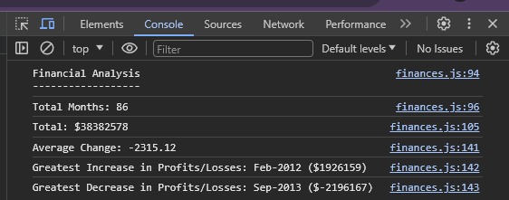

# Financial Analysis

## Description

All of the relevant content in this application can be seen in the console log. The main purpose of the data logged into the console is to analyse the profits and losses found within the dataset of financial records provided in the script.

Throughout this project I have learned to use for loops and if statements as well as various operators to display relevant data within the console.

### Console Log

This application can be found on [Github Pages.](https://applepieorchard.github.io/console-finances/)

## Installation

N/A

## Usage

To use the application press F12 to open the console and read the resulting logs. Alternatively you can right click on the page, click inspect and then click on the Console tab.

## Credits

N/A

## License

This Project is subject to the [MIT License.](LICENSE)